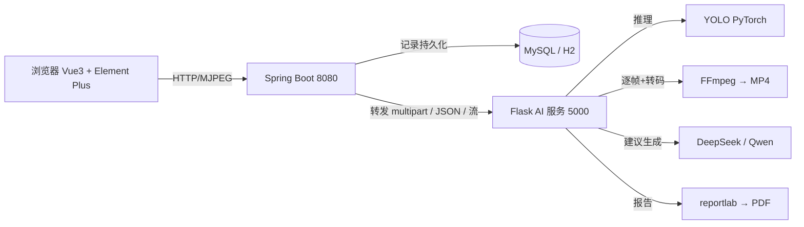

# 课堂行为智能检测系统 · 功能介绍

> 配套文档：[README（部署与运行）](../README.md) ｜ [原文分析与复刻规格](原文分析与复刻规格.md)

## 一、系统定位

面向课堂教学场景的行为识别与智能分析系统。用改进 YOLO（PyTorch）识别画面中的学生行为，
再交由大模型（DeepSeek / Qwen）生成学习状态评估与教学改进建议，最终输出可归档的 PDF 报告。

- **识别目标**：6 类课堂行为 —— 低头写字、低头看书、抬头听课、转头、举手、站立
- **输入形态**：单张图片、图片文件夹、视频文件、实时摄像头
- **输出形态**：标注图 / 标注视频、结构化检测数据、AI 分析建议、PDF 报告

## 二、功能模块一览

| # | 模块 | 说明 | 入口 |
|---|---|---|---|
| 1 | 单图检测 | 上传单张图片 → 返回标注图 + 类别/置信度/位置 + 耗时 | 前端「单图检测」 |
| 2 | 批量检测 | 选择图片文件夹（前端 JSZip 打包）或多图 → 逐张检测并汇总 | 前端「批量检测」 |
| 3 | 视频检测 | 上传视频 → MJPEG 实时流预览 → FFmpeg 转码输出 MP4 | 前端「视频检测」 |
| 4 | 摄像头检测 | 打开本机摄像头 → 实时标注流 → 可选录制保存 | 前端「摄像头」 |
| 5 | AI 智能分析 | 基于检测统计生成学习状态评估、课堂管理建议、关注群体、改进措施 | 任意检测页 / 记录页 |
| 6 | 记录管理 | 历史记录列表、分页筛选、详情查看、删除、清空 | 前端「检测记录」 |
| 7 | PDF 报告 | 检测统计 + 明细 + AI 建议，中文排版一键下载 | 检测页 / 记录页 |
| 8 | 系统总览 | 服务健康、运行引擎、类别清单、累计统计、使用流程 | 前端「系统总览」 |

## 三、模块详解

### 1. 单图检测

上传一张课堂照片，系统返回：

- **标注结果图**：每个目标带彩色包围框与「类别 + 置信度」标签（中文渲染）
- **检测明细**：`label`（行为类别）、`confidence`（置信度）、`box`（左上角/右下角坐标）
- **统计**：目标总数、各类别数量、平均/最高置信度
- **性能**：`elapsedMs`（推理耗时）

实测：单张 1280×720 图片，CPU 推理约 **70–250 ms**。

### 2. 批量检测（图片文件夹）

- 前端提供两种方式：**选择图片文件夹**（`webkitdirectory` + JSZip 打包上传，保留目录结构）或**选择多张图片**
- 后端逐张推理，返回每张的结果缩略图与明细，并给出合计的类别分布
- 汇总项：图片数、目标总数、各类别合计、总耗时

实测：6 张演示图 → 18 个目标，端到端约 **0.9 s**。

### 3. 视频检测

- 上传视频后创建异步任务，前端通过 **MJPEG 实时流**（`multipart/x-mixed-replace`）边处理边预览
- 进度条显示已处理帧数 / 总帧数、处理速率（FPS）
- 处理完成后由 **FFmpeg 管道编码为 H.264 MP4**（`yuv420p` + `faststart`，浏览器可直接播放）
- 可保存为检测记录；结果视频同时提供静态文件访问地址

实测：60 帧演示视频 → 处理速率约 **13.6 FPS**，输出 `outputs/out_*.mp4`。

### 4. 摄像头实时检测

- 指定摄像头索引（默认 0）开启，浏览器端以 MJPEG 流实时显示标注画面
- 支持勾选「同时录制保存为 MP4」
- 实时累计各类别检出数（帧级统计），可一键保存为检测记录
- 需浏览器具备摄像头权限（localhost 或 HTTPS 环境）

### 5. AI 智能分析建议

- 调用 **DeepSeek** 或 **Qwen**（OpenAI 兼容协议）生成四段式中文分析：
  1. 学习状态评估
  2. 课堂管理建议
  3. 需关注的学生群体
  4. 下一步教学改进措施
- **未配置 API Key 时自动使用本地规则引擎**：依据各类别占比（听课率、书写/阅读占比、转头率、举手率、站立率）
  按规则生成同等结构的建议，保证离线可用；返回结果中 `fallback=true` 标明来源
- 建议会随记录持久化，并进入 PDF 报告

### 6. 检测记录管理

- 记录字段：ID、类型（单图/批量/视频/摄像头）、来源文件名、目标数、耗时、引擎、创建时间
- 支持按类型筛选、分页、查看详情（结果图 + 类别统计 + 明细 + AI 建议）、单条删除、清空全部
- 存储层为 Spring Boot + JPA；默认 MySQL 8，无数据库环境可用 H2 文件库兜底

### 7. PDF 报告导出

- 后端生成（reportlab 注册 Adobe 中文字体 `STSong-Light`，无需外部字体文件；异常时自动回退 Pillow 绘制）
- 报告结构：
  1. 基本信息（记录编号、类型、来源、时间、目标数、推理耗时）
  2. 行为类别统计表（数量 + 占比）
  3. 检测明细表（最多 20 条：类别、置信度、位置）
  4. AI 分析与教学建议全文
- 演示引擎模式下会自动附加「仅供流程演示」的免责标注

### 8. 系统总览

- 服务状态：后端（8080）、AI 推理服务（5000）是否在线
- 运行引擎：`ultralytics`（真实推理）/ `demo`（演示引擎），并显示当前权重路径
- 6 类行为清单与累计检测统计（记录数、目标数、按类型分布）

## 四、检测结果字段说明

```json
{
  "ok": true,
  "engine": "ultralytics",
  "fallbackDemo": false,
  "count": 2,
  "elapsedMs": 71.42,
  "labels": [
    { "label": "站立", "label_en": "standing", "class_id": 5,
      "confidence": 0.6658, "box": [922, 485, 1051, 720] }
  ],
  "stats": { "total": 2, "per_class": { "站立": 1, "低头看书": 1 }, "avgConfidence": 0.6495 }
}
```

| 字段 | 含义 |
|---|---|
| `engine` | `ultralytics`=真实模型推理；`demo`=演示引擎（未加载权重） |
| `fallbackDemo` | 使用通用权重且画面中未检出目标时，由演示引擎补位 → 为 `true` |
| `labels[].box` | `[x1, y1, x2, y2]` 像素坐标，用于前端还原框位置 |
| `stats.per_class` | 六类别各自的检出数量，是 AI 建议与 PDF 报告的数据基础 |

## 五、技术架构与数据流



- **前端**：Vue3 + Vue Router + Pinia + Axios + Element Plus + ECharts + JSZip；Vite 开发代理 `/api → 8080`
- **后端**：Spring Boot 3.5 + Spring Data JPA + HikariCP；负责记录落库、协议转发、MJPEG 流代理、PDF 代理
- **AI 服务**：Flask + PyTorch(ultralytics)；检测引擎、视频/摄像头流水线、LLM 调用、PDF 生成
- **解耦设计**：AI 服务可独立运行与压测；后端仅做转发，便于替换为其他推理实现

## 六、接口清单

### AI 服务（5000）

| 方法 | 路径 | 说明 |
|---|---|---|
| GET | `/health` | 健康检查 |
| GET | `/api/model/status` | 引擎、权重、阈值、类别 |
| GET | `/api/classes` | 6 类行为清单 |
| POST | `/api/detect/image` | 单图检测 |
| POST | `/api/detect/batch` | 批量（多文件 / zip） |
| POST | `/api/detect/video` | 创建视频任务 |
| GET | `/api/video/stream/<id>` | 视频 MJPEG 实时流 |
| POST | `/api/camera/start` | 打开摄像头 |
| GET | `/api/camera/stream/<id>` | 摄像头 MJPEG 实时流 |
| POST | `/api/camera/stop/<id>` | 关闭摄像头 |
| GET | `/api/task/<id>` | 任务状态与统计 |
| POST | `/api/ai/advice` | AI 建议 |
| POST | `/api/report/pdf` | PDF 报告 |

### 后端（8080）

| 方法 | 路径 | 说明 |
|---|---|---|
| GET | `/api/system/status` | 后端 + AI 服务 + 模型状态 |
| GET | `/api/system/classes` | 行为类别 |
| POST | `/api/detect/image` `/batch` `/video` | 检测（转发并落库） |
| GET | `/api/detect/stream/video/<id>` `/camera/<id>` | MJPEG 流代理 |
| POST | `/api/camera/start` `/api/camera/stop/<id>` | 摄像头控制 |
| GET | `/api/records` `/api/records/<id>` | 记录列表 / 详情 |
| DELETE | `/api/records/<id>` `/api/records` | 删除单条 / 清空 |
| POST | `/api/records/<id>/advice` | 生成并保存 AI 建议 |
| GET | `/api/records/<id>/report` | 下载 PDF 报告 |
| GET | `/api/records/stats` | 累计统计 |

## 七、运行模式说明

| 模式 | 触发条件 | 表现 |
|---|---|---|
| **真实推理** | 存在课堂行为专用权重 `ai-service/models/best.pt` | 直接输出 6 类行为，置信度来自模型 |
| **通用权重映射** | 无 `best.pt`，自动使用官方 `yolov8n.pt` | 检出 COCO `person` 后按确定性规则映射为 6 类行为 |
| **演示引擎补位** | 通用权重在画面中未检出任何目标 | 由肤色检测 + 边缘显著性给出候选框，返回 `fallbackDemo=true`，图上带「演示引擎」水印 |

> 三者均返回统一的 6 类行为口径，前端与报告展示一致；模式在「系统总览」页与返回结果中始终可见，不会混淆。

## 八、一键验证

```bash
bash scripts/verify.sh          # 12 项端到端检查
# 或 Windows：powershell -ExecutionPolicy Bypass -File scripts\verify.ps1
```

覆盖：AI 健康、模型状态、单图、批量、后端状态、落库、记录列表、AI 建议、PDF 导出、视频任务/处理/保存。
